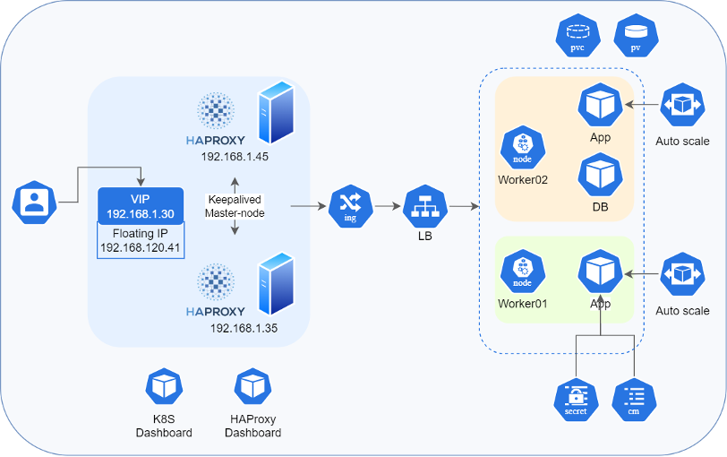
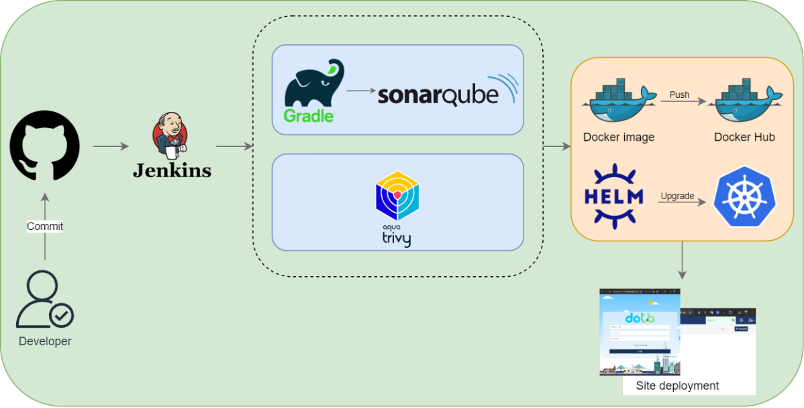

# Microservices-based Application Deployment System

This project implements a comprehensive management system and automation process for deploying a microservices-based application using Kubernetes.

## Key Technologies and Services

- **Kubernetes**: Container orchestration platform
- **Docker**: Containerization platform
- **Keepalived**: High availability solution
- **HAProxy**: Load balancer and proxy
- **Nginx Ingress**: Kubernetes ingress controller
- **Jenkins**: Automation server for CI/CD
- **SonarQube**: Continuous inspection of code quality
- **Trivy**: Open source vulnerability scanner
- **Helm**: Kubernetes package manager
- **Prometheus**: Monitoring and alerting toolkit
- **Grafana**: Analytics and interactive visualization platform

## System Architecture

The system is divided into two main components:

### 1. Management System

- **Management System Model**  

- **Kubernetes Cluster**: 
  - 1 master node and 2 worker nodes
  - Manages containerized applications and services

- **High Availability**:
  - Keepalived: Provides failover mechanism
    - 1 master node, 1 backup node
    - Manages Virtual IP (VIP) for continuous service

- **Load Balancing**:
  - HAProxy: Distributes incoming traffic
    - Uses round-robin method to forward requests to Nginx Ingress NodePorts

- **Ingress Controller**:
  - Nginx Ingress: Manages external access to services
    - Routes traffic based on defined ingress rules

- **Storage**:
  - Persistent Volume Claims (PVCs): Ensure data persistence

- **Monitoring and Visualization**:
  - Kubernetes Dashboard: Web-based UI for cluster management
  - HAProxy Dashboard: Monitors HAProxy statistics
  - Grafana: Visualizes metrics and creates dashboards
  - Prometheus: Collects and stores metrics

### 2. Automation System

- **Automation System Model**  

- **Continuous Integration/Continuous Deployment (CI/CD)**:
  - Jenkins: Orchestrates the CI/CD pipeline

- **Code Quality**:
  - SonarQube: Analyzes code quality and security

- **Security Scanning**:
  - Trivy: Scans container images for vulnerabilities

- **Deployment**:
  - Helm: Package manager for Kubernetes applications

- **Container Registry**:
  - Docker Registry: Stores and distributes Docker images

## Detailed Workflow

1. Developer commits code to GitHub repository
2. GitHub webhook triggers Jenkins pipeline
3. Jenkins initiates the CI/CD process:
   - Pulls latest code from GitHub
   - Runs SonarQube for code quality analysis
   - If quality gates pass, proceeds to build Docker image
   - Scans Docker image with Trivy for vulnerabilities
   - Pushes approved image to Docker registry
   - Uses Helm to deploy/update application on Kubernetes cluster
   - Performs post-deployment checks
   - Notifies development team of deployment status